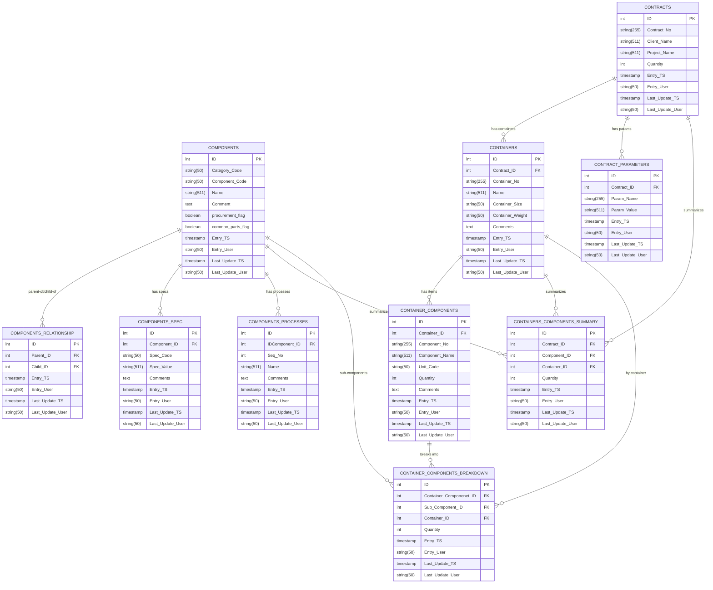

# Data Modeling

## Diagram




## DDL

```sql
SET NAMES utf8mb4;
SET FOREIGN_KEY_CHECKS = 0;

-- 1) Components
CREATE TABLE IF NOT EXISTS Components (
  ID                INT PRIMARY KEY AUTO_INCREMENT,
  Category_Code     VARCHAR(50),
  Component_Code    VARCHAR(50),
  Name              VARCHAR(511),
  Comment           TEXT,
  procurement_flag  TINYINT(1) DEFAULT 0,
  common_parts_flag TINYINT(1) DEFAULT 0,
  Entry_TS          TIMESTAMP DEFAULT CURRENT_TIMESTAMP(),
  Entry_User        VARCHAR(50) DEFAULT 'SYS_USER',
  Last_Update_TS    TIMESTAMP DEFAULT CURRENT_TIMESTAMP() ON UPDATE CURRENT_TIMESTAMP(),
  Last_Update_User  VARCHAR(50) DEFAULT 'SYS_USER'
) ENGINE=InnoDB;

-- 2) Contracts
CREATE TABLE IF NOT EXISTS Contracts (
  ID                INT PRIMARY KEY AUTO_INCREMENT,
  Contract_No       VARCHAR(255),
  Client_Name       VARCHAR(511),
  Project_Name      VARCHAR(511),
  Quantity           INT,
  Entry_TS           TIMESTAMP DEFAULT CURRENT_TIMESTAMP(),
  Entry_User         VARCHAR(50) DEFAULT 'SYS_USER',
  Last_Update_TS     TIMESTAMP DEFAULT CURRENT_TIMESTAMP() ON UPDATE CURRENT_TIMESTAMP(),
  Last_Update_User   VARCHAR(50) DEFAULT 'SYS_USER'
) ENGINE=InnoDB;

-- 3) Containers
CREATE TABLE IF NOT EXISTS Containers (
  ID                INT PRIMARY KEY AUTO_INCREMENT,
  Contract_ID       INT,
  Container_No      VARCHAR(255),
  Name               VARCHAR(511),
  Container_Size     VARCHAR(50),
  Container_Weight   VARCHAR(50),
  Comments            TEXT,
  Entry_TS             TIMESTAMP DEFAULT CURRENT_TIMESTAMP(),
  Entry_User             VARCHAR(50) DEFAULT 'SYS_USER',
  Last_Update_TS          TIMESTAMP DEFAULT CURRENT_TIMESTAMP() ON UPDATE CURRENT_TIMESTAMP(),
  Last_Update_User         VARCHAR(50) DEFAULT 'SYS_USER',
  INDEX idx_cont_contract (Contract_ID),
  CONSTRAINT fk_cont_contract
    FOREIGN KEY (Contract_ID) REFERENCES Contracts(ID)
) ENGINE=InnoDB;

-- 4) Container_Components
CREATE TABLE IF NOT EXISTS Container_Components (
  ID                INT PRIMARY KEY AUTO_INCREMENT,
  Container_ID      INT,
  Component_No      VARCHAR(255),
  Component_Name    VARCHAR(511),
  Unit_Code          VARCHAR(50),
  Quantity             INT,
  Comments               TEXT,
  Entry_TS                  TIMESTAMP DEFAULT CURRENT_TIMESTAMP(),
  Entry_User                  VARCHAR(50) DEFAULT 'SYS_USER',
  Last_Update_TS                TIMESTAMP DEFAULT CURRENT_TIMESTAMP() ON UPDATE CURRENT_TIMESTAMP(),
  Last_Update_User               VARCHAR(50) DEFAULT 'SYS_USER',
  INDEX idx_cc_container (Container_ID),
  CONSTRAINT fk_cc_container
    FOREIGN KEY (Container_ID) REFERENCES Containers(ID)
) ENGINE=InnoDB;

-- 5) Components_Spec
CREATE TABLE IF NOT EXISTS Components_Spec (
  ID                INT PRIMARY KEY AUTO_INCREMENT,
  Component_ID      INT,
  Spec_Code          VARCHAR(50),
  Spec_Value          VARCHAR(511),
  Comments              TEXT,
  Entry_TS                  TIMESTAMP DEFAULT CURRENT_TIMESTAMP(),
  Entry_User                  VARCHAR(50) DEFAULT 'SYS_USER',
  Last_Update_TS                TIMESTAMP DEFAULT CURRENT_TIMESTAMP() ON UPDATE CURRENT_TIMESTAMP(),
  Last_Update_User               VARCHAR(50) DEFAULT 'SYS_USER',
  INDEX idx_cs_component (Component_ID),
  CONSTRAINT fk_cs_component
    FOREIGN KEY (Component_ID) REFERENCES Components(ID)
) ENGINE=InnoDB;

-- 6) Components_Relationship
CREATE TABLE IF NOT EXISTS Components_Relationship (
  ID                INT PRIMARY KEY AUTO_INCREMENT,
  Parent_ID          INT,
  Child_ID             INT,
  Entry_TS                  TIMESTAMP DEFAULT CURRENT_TIMESTAMP(),
  Entry_User                  VARCHAR(50) DEFAULT 'SYS_USER',
  Last_Update_TS                TIMESTAMP DEFAULT CURRENT_TIMESTAMP() ON UPDATE CURRENT_TIMESTAMP(),
  Last_Update_User               VARCHAR(50) DEFAULT 'SYS_USER',
  INDEX idx_cr_parent (Parent_ID),
  INDEX idx_cr_child  (Child_ID),
  CONSTRAINT fk_cr_parent FOREIGN KEY (Parent_ID) REFERENCES Components(ID),
  CONSTRAINT fk_cr_child  FOREIGN KEY (Child_ID)  REFERENCES Components(ID)
) ENGINE=InnoDB;

-- 7) Components_processes
CREATE TABLE IF NOT EXISTS Components_processes (
  ID                INT PRIMARY KEY AUTO_INCREMENT,
  IDComponent_ID      INT,
  Seq_No                 INT,
  Name                      VARCHAR(511),
  Comments                    TEXT,
  Entry_TS                        TIMESTAMP DEFAULT CURRENT_TIMESTAMP(),
  Entry_User                        VARCHAR(50) DEFAULT 'SYS_USER',
  Last_Update_TS                      TIMESTAMP DEFAULT CURRENT_TIMESTAMP() ON UPDATE CURRENT_TIMESTAMP(),
  Last_Update_User                     VARCHAR(50) DEFAULT 'SYS_USER',
  INDEX idx_cpp_component (IDComponent_ID),
  CONSTRAINT fk_cpp_component
    FOREIGN KEY (IDComponent_ID) REFERENCES Components(ID)
) ENGINE=InnoDB;

-- 8) Contract_Parameters
CREATE TABLE IF NOT EXISTS Contract_Parameters (
  ID                INT PRIMARY KEY AUTO_INCREMENT,
  Contract_ID         INT,
  Param_Name             VARCHAR(255),
  Param_Value               VARCHAR(511),
  Entry_TS                        TIMESTAMP DEFAULT CURRENT_TIMESTAMP(),
  Entry_User                        VARCHAR(50) DEFAULT 'SYS_USER',
  Last_Update_TS                      TIMESTAMP DEFAULT CURRENT_TIMESTAMP() ON UPDATE CURRENT_TIMESTAMP(),
  Last_Update_User                     VARCHAR(50) DEFAULT 'SYS_USER',
  INDEX idx_cp_contract (Contract_ID),
  CONSTRAINT fk_cp_contract
    FOREIGN KEY (Contract_ID) REFERENCES Contracts(ID)
) ENGINE=InnoDB;

-- 9) Containers_Components_Summary
CREATE TABLE IF NOT EXISTS Containers_Components_Summary (
  ID                INT PRIMARY KEY AUTO_INCREMENT,
  Contract_ID         INT,
  Component_ID           INT,
  Container_ID               INT,
  Quantity                       INT,
  Entry_TS                            TIMESTAMP DEFAULT CURRENT_TIMESTAMP(),
  Entry_User                            VARCHAR(50) DEFAULT 'SYS_USER',
  Last_Update_TS                            TIMESTAMP DEFAULT CURRENT_TIMESTAMP() ON UPDATE CURRENT_TIMESTAMP(),
  Last_Update_User                             VARCHAR(50) DEFAULT 'SYS_USER',
  INDEX idx_ccs_contract  (Contract_ID),
  INDEX idx_ccs_component (Component_ID),
  INDEX idx_ccs_container (Container_ID),
  CONSTRAINT fk_ccs_contract  FOREIGN KEY (Contract_ID)  REFERENCES Contracts(ID),
  CONSTRAINT fk_ccs_component FOREIGN KEY (Component_ID) REFERENCES Components(ID),
  CONSTRAINT fk_ccs_container FOREIGN KEY (Container_ID) REFERENCES Containers(ID)
) ENGINE=InnoDB;

-- 10) Container_Components_Breakdown
CREATE TABLE IF NOT EXISTS Container_Components_Breakdown (
  ID                         INT PRIMARY KEY AUTO_INCREMENT,
  Container_Componenet_ID    INT,
  Sub_Component_ID            INT,
  Container_ID                  INT,
  Quantity                          INT,
  Entry_TS                                TIMESTAMP DEFAULT CURRENT_TIMESTAMP(),
  Entry_User                                VARCHAR(50) DEFAULT 'SYS_USER',
  Last_Update_TS                                TIMESTAMP DEFAULT CURRENT_TIMESTAMP() ON UPDATE CURRENT_TIMESTAMP(),
  Last_Update_User                                 VARCHAR(50) DEFAULT 'SYS_USER',
  INDEX idx_ccb_ccid      (Container_Componenet_ID),
  INDEX idx_ccb_subcomp   (Sub_Component_ID),
  INDEX idx_ccb_container (Container_ID),
  CONSTRAINT fk_ccb_ccid      FOREIGN KEY (Container_Componenet_ID) REFERENCES Container_Components(ID),
  CONSTRAINT fk_ccb_subcomp   FOREIGN KEY (Sub_Component_ID)        REFERENCES Components(ID),
  CONSTRAINT fk_ccb_container FOREIGN KEY (Container_ID)            REFERENCES Containers(ID)
) ENGINE=InnoDB;

SET FOREIGN_KEY_CHECKS = 1;

```

