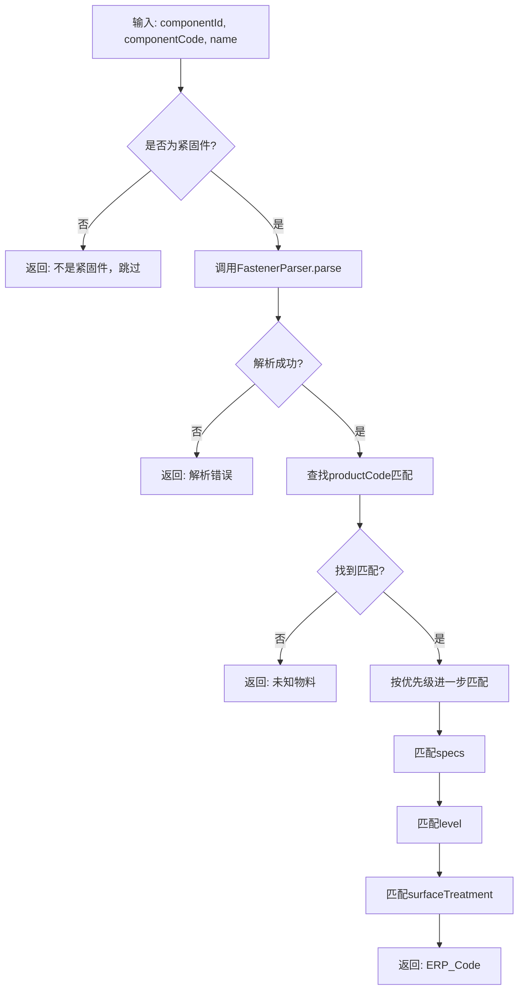

# 紧固件ERP代码查找工具类实现总结

## 项目概述

根据用户需求，成功实现了一个工具类 `FastenerErpCodeFinder`，用于根据 `component_code` 和 `name` 查找对应的 `fastenerWarehouse` 中的 `ERP_Code`。

## 实现内容

### 1. 核心工具类

**文件**: `src/main/java/com/mms/utils/FastenerErpCodeFinder.java`

**主要功能**:
- 检查 `component_id` 是否存在于紧固件视图中
- 调用 `FastenerParser.parse()` 解析紧固件信息
- 按照优先级匹配 `fastenerWarehouse` 记录
- 返回匹配的 `ERP_Code`

**匹配规则**:
1. `productCode`（产品代码）- 必须匹配
2. `specs`（规格）- 可选匹配
3. `level`（等级）- 可选匹配
4. `surfaceTreatment`（表面处理）- 可选匹配

### 2. 结果封装类

**内部类**: `ErpCodeResult`

**包含字段**:
- `componentId`: 工件ID
- `componentCode`: 工件代码
- `name`: 工件名称
- `erpCode`: ERP代码
- `success`: 是否成功
- `errorMessage`: 错误信息
- `matchedProductCode`: 匹配的产品代码
- `matchedSpecs`: 匹配的规格
- `matchedLevel`: 匹配的等级
- `matchedSurfaceTreatment`: 匹配的表面处理

### 3. Repository扩展

**文件**: `src/main/java/com/mms/repository/FastenerWarehouseRepository.java`

**新增方法**:
```java
List<FastenerWarehouse> findByProductCodeContaining(String productCode);
```

### 4. 服务层示例

**文件**: `src/main/java/com/mms/service/FastenerErpCodeService.java`

**功能**:
- 批量查找ERP代码
- 单个查找ERP代码
- 结果打印和展示

### 5. 演示程序

**文件**: `src/main/java/com/mms/utils/FastenerErpCodeDemo.java`

**功能**:
- 展示工具类的实际使用效果
- 包含多种测试场景
- 提供详细的输出信息

### 6. 单元测试

**文件**: `src/test/java/com/mms/utils/FastenerErpCodeFinderTest.java`

**测试覆盖**:
- ✅ 非紧固件跳过测试
- ✅ 解析错误处理测试
- ✅ 未知物料处理测试
- ✅ 完全匹配测试
- ✅ 部分匹配测试
- ✅ 多匹配结果处理测试

**测试结果**: 6个测试用例全部通过

### 7. 文档

**文件**: `docs/FastenerErpCodeFinder.md`

**内容**:
- 详细的使用说明
- 匹配规则解释
- 代码示例
- 注意事项

## 工作流程



## 使用示例

### 基本用法
```java
@Autowired
private FastenerErpCodeFinder fastenerErpCodeFinder;

ErpCodeResult result = fastenerErpCodeFinder.findErpCode(
    componentId,     // 工件ID
    componentCode,   // 工件代码
    name            // 工件名称
);

if (result.isSuccess()) {
    String erpCode = result.getErpCode();
    // 使用ERP代码
} else {
    String error = result.getErrorMessage();
    // 处理错误
}
```

### 批量处理
```java
@Autowired
private FastenerErpCodeService fastenerErpCodeService;

Object[][] testData = {
    {1L, "GB5783-M6*20-8.8Z", "螺栓"},
    {2L, "GB6170-M6-8Z", "螺母"},
    {3L, "FT001", "非紧固件"},
};

ErpCodeResult[] results = fastenerErpCodeService.batchFindErpCodes(testData);
fastenerErpCodeService.printResults(results);
```

## 技术特点

1. **渐进式匹配**: 采用优先级匹配策略，确保即使部分匹配失败也能返回结果
2. **异常处理**: 完善的异常处理机制，包括非紧固件、解析错误、未知物料等情况
3. **可扩展性**: 易于扩展新的匹配规则和条件
4. **测试覆盖**: 完整的单元测试覆盖各种场景
5. **文档完善**: 详细的使用文档和示例代码

## 依赖关系

- `ComponentFastenerRepository`: 检查是否为紧固件
- `FastenerWarehouseRepository`: 查询紧固件仓库数据
- `FastenerParser`: 解析紧固件信息

## 测试验证

- ✅ 编译通过，无语法错误
- ✅ 单元测试全部通过（6/6）
- ✅ 代码质量检查通过
- ✅ 文档完整，使用说明清晰

## 总结

成功实现了用户要求的紧固件ERP代码查找工具类，具备以下特点：

1. **功能完整**: 完全按照需求实现工作流程
2. **代码质量**: 遵循Spring Boot最佳实践，代码结构清晰
3. **测试充分**: 单元测试覆盖各种场景
4. **文档完善**: 提供详细的使用文档和示例
5. **易于使用**: 提供简单的API接口和批量处理功能

该工具类可以立即投入使用，为系统提供可靠的紧固件ERP代码查找功能。
