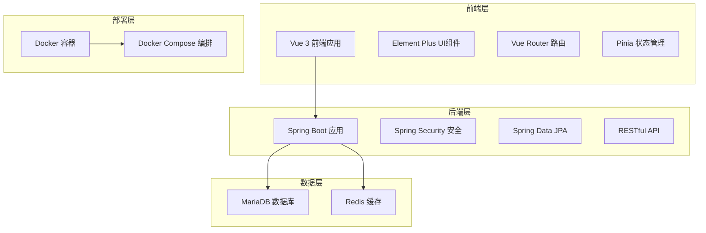
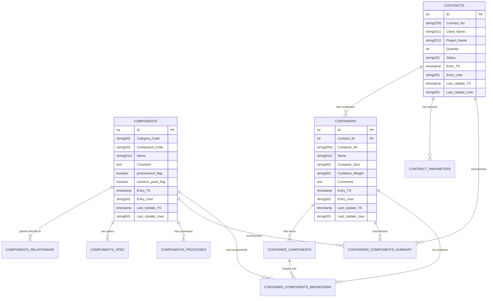
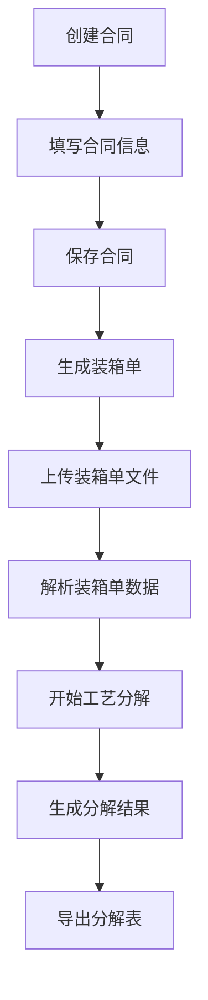
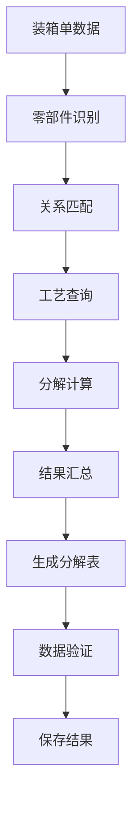
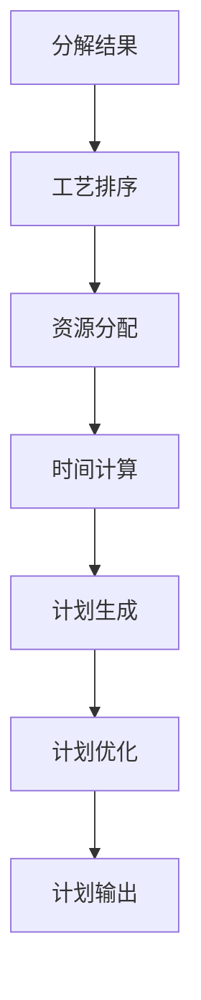

# MMS制造管理系统 - 系统设计文档

## 1. 项目概述

### 1.1 项目背景
MMS制造管理系统是一个专为电梯制造行业设计的工艺分解和管理系统。系统能够根据合同和装箱单数据，自动生成工艺分解表，并提供完整的生产计划、成本估算和投标报价功能。

### 1.2 技术架构
- **架构模式**: 前后端分离架构
- **后端技术栈**: Spring Boot 3.2.0 + Java 21
- **前端技术栈**: Vue 3 + Element Plus
- **数据库**: MariaDB 10.3
- **缓存**: Redis 6.0
- **部署方式**: Docker容器化部署

### 1.3 核心功能
1. 合同管理
2. 零部件管理
3. 装箱单管理
4. 工艺分解
5. 生产计划
6. 成本估算
7. 投标报价
8. 历史记录管理

## 2. 系统架构设计

### 2.1 整体架构图



### 2.2 技术栈详细说明

#### 后端技术栈
- **Spring Boot 3.2.0**: 主框架，提供自动配置和快速开发能力
- **Java 21**: 编程语言，支持最新特性
- **Spring Data JPA**: 数据访问层，简化数据库操作
- **Spring Security**: 安全框架，提供认证和授权
- **MariaDB**: 关系型数据库，存储业务数据
- **Redis**: 缓存数据库，提供分布式缓存和锁
- **Redisson**: Redis客户端，提供分布式锁功能
- **Apache POI**: Excel文件处理
- **iText**: PDF文件生成
- **Lombok**: 代码简化工具

#### 前端技术栈
- **Vue 3**: 前端框架，使用Composition API
- **Vite**: 构建工具，提供快速开发体验
- **Element Plus**: UI组件库，提供丰富的组件
- **Vue Router**: 路由管理，支持单页应用
- **Pinia**: 状态管理，替代Vuex
- **Axios**: HTTP客户端，处理API请求
- **ECharts**: 图表库，数据可视化
- **Sass**: CSS预处理器

## 3. 数据库设计

### 3.1 核心实体关系图



### 3.2 主要数据表说明

#### 3.2.1 核心业务表
- **components**: 零部件基础信息表
- **contracts**: 合同信息表
- **containers**: 装箱单表
- **container_components**: 装箱组件表

#### 3.2.2 关系配置表
- **components_spec**: 零部件规格表
- **components_relationship**: 零部件关系表
- **components_processes**: 零部件工艺表
- **contract_parameters**: 合同参数表

#### 3.2.3 汇总分解表
- **containers_components_summary**: 装箱组件汇总表
- **container_components_breakdown**: 装箱组件分解表

### 3.3 数据库设计特点
1. **审计字段**: 所有表都包含创建时间、创建用户、更新时间、更新用户字段
2. **外键约束**: 保证数据完整性
3. **索引优化**: 为常用查询字段建立索引
4. **字段长度**: 根据业务需求合理设置字段长度

## 4. 后端架构设计

### 4.1 包结构设计

```
src/main/java/com/mms/
├── MmsDecomposorApplication.java    # 主应用类
├── config/                          # 配置类
│   ├── JpaConfig.java              # JPA配置
│   ├── RedisConfig.java            # Redis配置
│   └── SecurityConfig.java         # 安全配置
├── controller/                      # 控制器层
│   ├── AuthController.java         # 认证控制器
│   ├── ContractsController.java    # 合同控制器
│   ├── ComponentsController.java   # 零部件控制器
│   ├── ContainersController.java   # 装箱单控制器
│   └── ...
├── entity/                          # 实体类
│   ├── BaseEntity.java            # 基础实体类
│   ├── Components.java            # 零部件实体
│   ├── Contracts.java             # 合同实体
│   └── ...
├── repository/                      # 数据访问层
│   ├── ComponentsRepository.java  # 零部件仓库
│   ├── ContractsRepository.java   # 合同仓库
│   └── ...
└── service/                        # 服务层
    ├── ContractsService.java      # 合同服务接口
    ├── ComponentsService.java     # 零部件服务接口
    └── impl/                      # 服务实现
        ├── ContractsServiceImpl.java
        └── ComponentsServiceImpl.java
```

### 4.2 核心设计模式

#### 4.2.1 分层架构
- **Controller层**: 处理HTTP请求，参数验证，响应格式化
- **Service层**: 业务逻辑处理，事务管理
- **Repository层**: 数据访问，JPA操作
- **Entity层**: 数据模型，JPA实体映射

#### 4.2.2 依赖注入
使用Spring的依赖注入机制，通过构造函数注入实现松耦合

#### 4.2.3 配置管理
- **application.yml**: 应用配置文件
- **配置类**: 使用@Configuration注解的配置类

### 4.3 安全设计

#### 4.3.1 Spring Security配置
```java
@Configuration
@EnableWebSecurity
public class SecurityConfig {
    // CORS配置
    // CSRF禁用
    // 会话管理
    // 权限控制
}
```

#### 4.3.2 认证机制
- JWT Token认证
- 用户登录/登出
- 权限验证

### 4.4 缓存设计

#### 4.4.1 Redis缓存
- 分布式缓存
- 分布式锁
- 会话存储

#### 4.4.2 缓存策略
- 查询结果缓存
- 热点数据缓存
- 缓存失效策略

## 5. 前端架构设计

### 5.1 项目结构

```
frontend/src/
├── api/                    # API接口
│   ├── components.js      # 零部件API
│   ├── containers.js      # 装箱单API
│   ├── contracts.js      # 合同API
│   └── index.js          # API入口
├── components/             # 公共组件
│   └── CreateContainerDialog.vue
├── layouts/               # 布局组件
│   └── MainLayout.vue     # 主布局
├── router/                # 路由配置
│   └── index.js          # 路由定义
├── stores/                # 状态管理
│   └── user.js           # 用户状态
├── styles/                # 样式文件
│   └── index.scss        # 主样式
├── views/                 # 页面组件
│   ├── Dashboard.vue     # 仪表盘
│   ├── Contracts.vue    # 合同管理
│   ├── Components.vue    # 零部件管理
│   ├── Containers.vue    # 装箱单管理
│   └── ...
├── App.vue               # 根组件
└── main.js               # 入口文件
```

### 5.2 路由设计

#### 5.2.1 路由结构
```javascript
const routes = [
  {
    path: '/login',
    name: 'Login',
    component: () => import('@/views/Login.vue'),
    meta: { requiresAuth: false }
  },
  {
    path: '/',
    component: () => import('@/layouts/MainLayout.vue'),
    meta: { requiresAuth: true },
    children: [
      { path: '', name: 'Dashboard', component: () => import('@/views/Dashboard.vue') },
      { path: '/contracts', name: 'Contracts', component: () => import('@/views/Contracts.vue') },
      { path: '/components', name: 'Components', component: () => import('@/views/Components.vue') },
      // ... 其他路由
    ]
  }
]
```

#### 5.2.2 路由守卫
- 认证检查
- 权限验证
- 页面标题设置

### 5.3 状态管理

#### 5.3.1 Pinia Store设计
```javascript
// stores/user.js
export const useUserStore = defineStore('user', {
  state: () => ({
    user: null,
    token: null,
    isLoggedIn: false
  }),
  actions: {
    login(credentials) { /* 登录逻辑 */ },
    logout() { /* 登出逻辑 */ },
    initUser() { /* 初始化用户信息 */ }
  }
})
```

### 5.4 组件设计

#### 5.4.1 布局组件
- **MainLayout**: 主布局，包含侧边栏、头部、内容区
- **侧边栏**: 导航菜单，支持折叠
- **头部**: 用户信息、系统设置

#### 5.4.2 业务组件
- **数据表格**: 支持分页、搜索、排序
- **表单组件**: 数据录入和编辑
- **对话框**: 弹窗操作
- **图表组件**: 数据可视化

### 5.5 UI设计规范

#### 5.5.1 Element Plus组件库
- 统一的视觉风格
- 响应式设计
- 国际化支持

#### 5.5.2 样式管理
- Sass预处理器
- 主题定制
- 组件样式隔离

## 6. API设计

### 6.1 RESTful API规范

#### 6.1.1 URL设计
- 使用名词而非动词
- 使用复数形式
- 层级结构清晰

#### 6.1.2 HTTP方法
- GET: 查询数据
- POST: 创建数据
- PUT: 更新数据
- DELETE: 删除数据

### 6.2 核心API接口

#### 6.2.1 认证接口
```
POST /api/auth/login          # 用户登录
POST /api/auth/logout         # 用户登出
GET  /api/auth/me            # 获取当前用户信息
```

#### 6.2.2 合同管理接口
```
GET    /api/contracts                    # 获取合同列表
GET    /api/contracts/{id}              # 获取合同详情
POST   /api/contracts                    # 创建合同
PUT    /api/contracts/{id}               # 更新合同
DELETE /api/contracts/{id}               # 删除合同
GET    /api/contracts/search             # 搜索合同
POST   /api/contracts/{id}/containers/generate  # 生成装箱单
POST   /api/contracts/{id}/breakdown/start       # 开始工艺分解
GET    /api/contracts/{id}/breakdown/result      # 获取分解结果
GET    /api/contracts/{id}/breakdown/export      # 导出分解表
```

#### 6.2.3 零部件管理接口
```
GET    /api/components                   # 获取零部件列表
GET    /api/components/{id}               # 获取零部件详情
POST   /api/components                    # 创建零部件
PUT    /api/components/{id}               # 更新零部件
DELETE /api/components/{id}              # 删除零部件
```

#### 6.2.4 装箱单管理接口
```
GET    /api/containers                   # 获取装箱单列表
GET    /api/containers/{id}              # 获取装箱单详情
POST   /api/containers                   # 创建装箱单
PUT    /api/containers/{id}              # 更新装箱单
DELETE /api/containers/{id}              # 删除装箱单
POST   /api/containers/upload            # 上传装箱单文件
GET    /api/containers/{id}/preview      # 预览装箱单
```

### 6.3 响应格式规范

#### 6.3.1 成功响应
```json
{
  "success": true,
  "message": "操作成功",
  "data": { /* 响应数据 */ }
}
```

#### 6.3.2 错误响应
```json
{
  "success": false,
  "message": "错误信息",
  "error": "ERROR_CODE",
  "details": { /* 错误详情 */ }
}
```

## 7. 业务流程设计

### 7.1 合同管理流程



### 7.2 工艺分解流程



### 7.3 生产计划流程



## 8. 部署架构设计

### 8.1 Docker容器化

#### 8.1.1 容器结构
```yaml
version: '3.8'
services:
  mariadb:
    image: mariadb:10.3
    environment:
      MYSQL_ROOT_PASSWORD: password
      MYSQL_DATABASE: mms_db
    ports:
      - "3306:3306"
    volumes:
      - mariadb_data:/var/lib/mysql

  redis:
    image: redis:6.0-alpine
    ports:
      - "6379:6379"

  backend:
    build: .
    ports:
      - "8080:8080"
    depends_on:
      - mariadb
      - redis
    environment:
      SPRING_DATASOURCE_URL: jdbc:mariadb://mariadb:3306/mms_db
      SPRING_REDIS_HOST: redis

  frontend:
    build: ./frontend
    ports:
      - "3000:80"
    depends_on:
      - backend
```

#### 8.1.2 镜像构建
- **后端镜像**: 基于OpenJDK 21，包含Spring Boot应用
- **前端镜像**: 基于Nginx，包含Vue.js应用
- **数据库镜像**: 官方MariaDB镜像
- **缓存镜像**: 官方Redis镜像

### 8.2 环境配置

#### 8.2.1 开发环境
- 热重载支持
- 调试模式
- 开发工具集成

#### 8.2.2 生产环境
- 性能优化
- 安全加固
- 监控配置

### 8.3 启动脚本

#### 8.3.1 一键启动
```bash
# start.sh
#!/bin/bash
docker-compose up -d
```

#### 8.3.2 环境检查
```bash
# check-env.bat
# 检查Java、Maven、Node.js、Docker环境
```

## 9. 性能优化设计

### 9.1 数据库优化

#### 9.1.1 索引优化
- 主键索引
- 外键索引
- 查询字段索引
- 复合索引

#### 9.1.2 查询优化
- 分页查询
- 懒加载
- 批量操作
- 查询缓存

### 9.2 缓存策略

#### 9.2.1 Redis缓存
- 查询结果缓存
- 热点数据缓存
- 分布式锁
- 会话存储

#### 9.2.2 缓存更新
- 主动更新
- 被动失效
- 缓存穿透防护

### 9.3 前端优化

#### 9.3.1 构建优化
- 代码分割
- 懒加载
- 资源压缩
- Tree Shaking

#### 9.3.2 运行时优化
- 虚拟滚动
- 防抖节流
- 内存管理
- 组件缓存

## 10. 安全设计

### 10.1 认证安全

#### 10.1.1 用户认证
- JWT Token机制
- 密码加密存储
- 会话管理
- 登录限制

#### 10.1.2 权限控制
- 角色权限
- 资源权限
- API权限
- 页面权限

### 10.2 数据安全

#### 10.2.1 数据加密
- 敏感数据加密
- 传输加密
- 存储加密

#### 10.2.2 数据备份
- 定期备份
- 增量备份
- 异地备份
- 恢复测试

### 10.3 系统安全

#### 10.3.1 网络安全
- HTTPS协议
- CORS配置
- 防火墙
- 入侵检测

#### 10.3.2 应用安全
- 输入验证
- SQL注入防护
- XSS防护
- CSRF防护

## 11. 监控和日志

### 11.1 系统监控

#### 11.1.1 性能监控
- CPU使用率
- 内存使用率
- 磁盘I/O
- 网络流量

#### 11.1.2 应用监控
- 响应时间
- 吞吐量
- 错误率
- 可用性

### 11.2 日志管理

#### 11.2.1 日志级别
- ERROR: 错误日志
- WARN: 警告日志
- INFO: 信息日志
- DEBUG: 调试日志

#### 11.2.2 日志格式
- 结构化日志
- 时间戳
- 用户信息
- 请求ID

## 12. 扩展性设计

### 12.1 水平扩展

#### 12.1.1 负载均衡
- 应用层负载均衡
- 数据库读写分离
- 缓存集群
- 文件存储分离

#### 12.1.2 微服务架构
- 服务拆分
- 服务注册发现
- 配置中心
- 网关服务

### 12.2 功能扩展

#### 12.2.1 插件机制
- 业务插件
- 数据源插件
- 导出插件
- 通知插件

#### 12.2.2 API扩展
- 版本管理
- 向后兼容
- 接口文档
- SDK提供

## 13. 开发规范

### 13.1 代码规范

#### 13.1.1 Java代码规范
- 命名规范
- 注释规范
- 异常处理
- 单元测试

#### 13.1.2 Vue.js代码规范
- 组件规范
- 样式规范
- 状态管理
- 测试规范

### 13.2 版本管理

#### 13.2.1 Git工作流
- 分支管理
- 提交规范
- 代码审查
- 发布流程

#### 13.2.2 版本号规范
- 语义化版本
- 变更日志
- 发布说明
- 回滚策略

## 14. 测试策略

### 14.1 测试类型

#### 14.1.1 单元测试
- 服务层测试
- 工具类测试
- 组件测试
- 覆盖率要求

#### 14.1.2 集成测试
- API测试
- 数据库测试
- 缓存测试
- 文件处理测试

#### 14.1.3 端到端测试
- 用户流程测试
- 浏览器兼容性
- 性能测试
- 安全测试

### 14.2 测试工具

#### 14.2.1 后端测试
- JUnit 5
- Mockito
- TestContainers
- Spring Boot Test

#### 14.2.2 前端测试
- Vitest
- Vue Test Utils
- Cypress
- Jest

## 15. 文档管理

### 15.1 技术文档
- API文档
- 数据库文档
- 部署文档
- 开发文档

### 15.2 用户文档
- 用户手册
- 操作指南
- 常见问题
- 视频教程

## 16. 总结

MMS制造管理系统采用现代化的技术栈和架构设计，具有以下特点：

1. **技术先进性**: 使用最新的Spring Boot 3.2.0和Java 21
2. **架构合理性**: 前后端分离，分层清晰
3. **扩展性强**: 支持水平扩展和功能扩展
4. **安全性高**: 完整的安全机制和权限控制
5. **部署简单**: Docker容器化，一键部署
6. **维护性好**: 代码规范，文档完善

该系统为电梯制造行业的工艺分解和管理提供了完整的技术解决方案，具有良好的可扩展性和维护性，能够满足企业级应用的需求。
